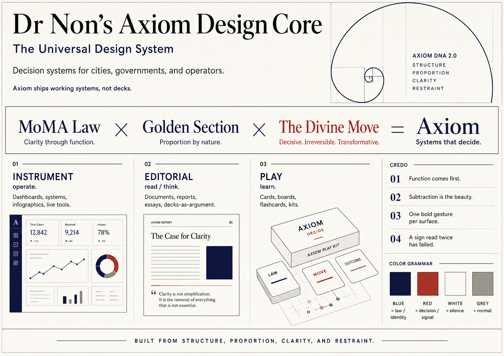
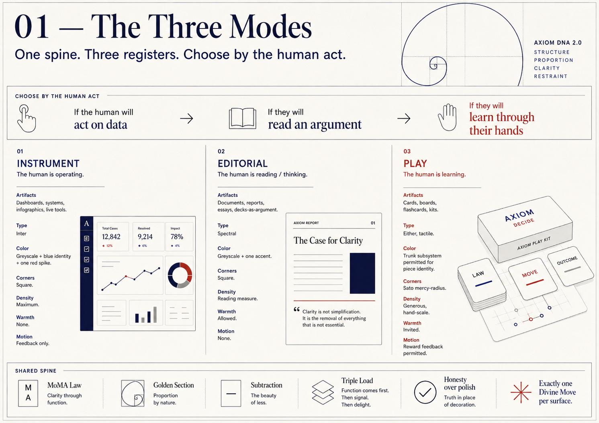
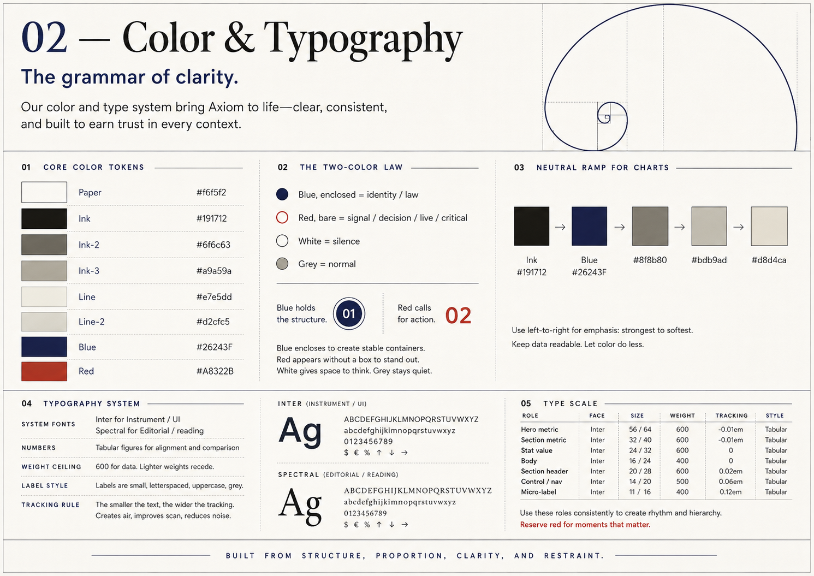
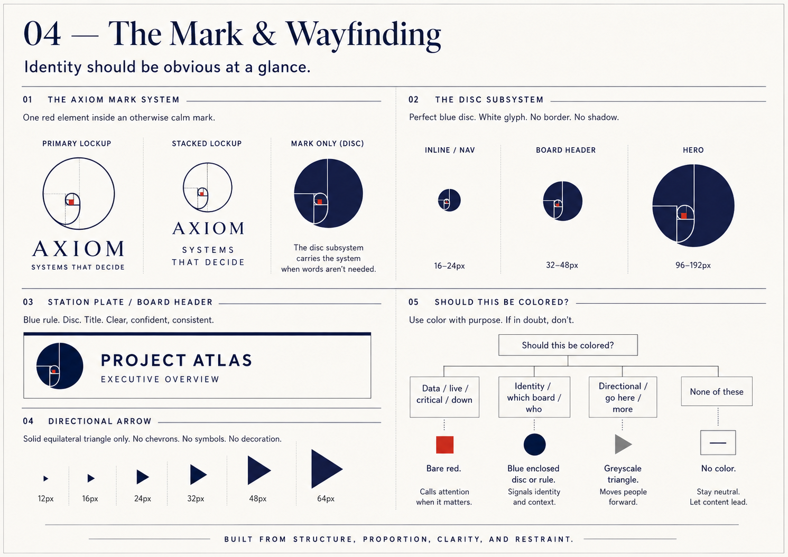
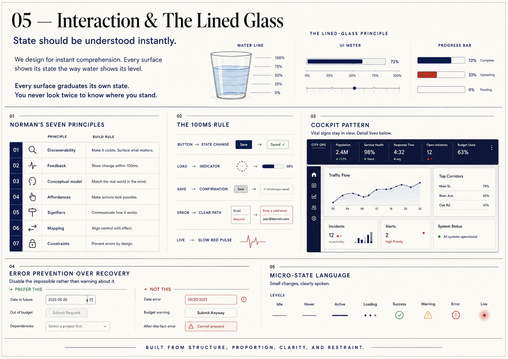
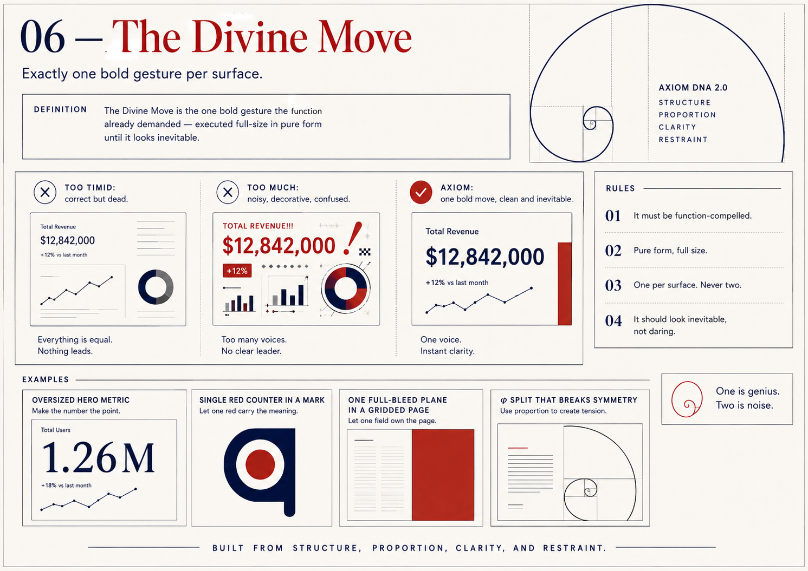

# Axiom Design Core

> Beauty is what remains after everything that does not work is gone.  
> Function first. Then subtract. The subtraction is the beauty.  
> One bold move, purely cut, until it looks like it was always there.

**For:** Axiom — decision systems for cities, governments, and operators. `axiom.nonarkara.org`  
**Use:** Throw this repo at any agent — slide-maker, infographic-maker, dashboard-builder, document-writer. Everything needed to produce correct Axiom design.  
**Version:** 2.0 — The Living Edition  
**Lineage:** Rams · Moggridge · Norman · MoMA Digital · Maeda · Vignelli/NYCTA · Sullivan · Wright · Kahn · Koolhaas · Murcutt · Bawa · Ongard · Sato · Hemingway · Bukowski · Kant



---

## The Equation

**MoMA Law × Golden Section × The Divine Move = Axiom.**

- **MoMA Law:** every edge resolves to another edge. Nothing floats. The grid is invisible because everything snaps to it.
- **Golden Section:** find 1.618 in every composition — splits, margins, the mark, the page.
- **The Divine Move:** exactly one bold gesture per surface — the one the function already demanded, executed full-size in pure form, until it looks inevitable rather than daring. Never two. Two is noise.

---

## Three Modes

Pick by the human's **act**, not by taste.

| | INSTRUMENT | EDITORIAL | PLAY |
|---|---|---|---|
| **Human is** | operating | reading / thinking | learning / playing |
| **Artifacts** | dashboards, systems, infographics, live tools | documents, CVs, essays, reports, decks | board/card/flashcard games, workbooks |
| **Type** | Inter only | Spectral serif permitted | either |
| **Color** | greyscale + blue identity + one red spike | greyscale + one accent | trunk subsystem permitted |
| **Corners** | square (0–2px) | square | Sato mercy-radius permitted |
| **Density** | maximum | reading measure 60–72ch | generous, hand-scale |

When unsure: **Instrument is the default.** It is the most disciplined and the hardest to cheat.



---

## Quick-Start

Drop this into any HTML file to get a correct Axiom surface:

```html
<link rel="stylesheet" href="tokens.css">
```

Or copy the token block directly:

```css
:root {
  --paper: #f6f5f2;   /* page ground */
  --panel: #ffffff;   /* cells, instrument faces */
  --ink: #191712;     /* primary text */
  --ink-2: #6f6c63;   /* secondary text */
  --ink-3: #a9a59a;   /* labels, meta */
  --line: #e7e5dd;    /* hairlines, gaps */
  --line-2: #d2cfc5;  /* stronger borders */
  --blue: #26243F;    /* the law — identity, enclosed */
  --red: #A8322B;     /* the Move — live, critical, bare */
  --font-sans: 'Inter', 'Helvetica Neue', Helvetica, Arial, sans-serif;
  --font-serif: 'Spectral', Georgia, 'Times New Roman', serif;
}
```

The hairline cell grid — the signature move:

```html
<div style="display:grid; grid-template-columns:repeat(4,1fr);
            gap:1px; background:var(--line); border:1px solid var(--line);">
  <div style="background:var(--panel); padding:13px 16px;">…cell…</div>
</div>
```

---

## Files in This Repo

| File | What it is |
|---|---|
| `AXIOM-DNA.md` | The full system — 22 sections, every rule, every code example. Read this. |
| `tokens.css` | All CSS tokens as a ready-to-import stylesheet. Drop in any project. |
| `components.html` | Live rendered component gallery. Open in a browser. |
| `quick-start.html` | Minimal Instrument-mode page template. Clone and edit. |
| `assets/photos/` | **Drop photos here.** See `assets/photos/README.md` for naming convention. |
| `assets/diagrams/` | **Drop diagrams here.** See `assets/diagrams/README.md`. |
| `assets/logo/` | Logo files. See `assets/logo/README.md`. |

---

## The Color Law

```
Is it DATA (live / critical / down)?  → bare --red. No disc.
Is it IDENTITY (which board / who)?   → enclose it. Blue disc or rule.
Is it DIRECTIONAL (go here / more)?   → greyscale triangle.
None of these?                        → no color. Grey + size.
```

If you add color "to liven it up," you have failed every master. Delete it.



---

## The Mark & Wayfinding

Identity should be obvious at a glance. The Axiom mark, the disc subsystem, the station plate, the directional triangle — all governed by one question: does the form explain the function instantly?



---

## Grid, Proportion & MoMA Law

Every edge resolves to another edge. The grid is invisible because everything snaps to it. The Golden Section (φ = 1.618) lives in every split, every margin, every composition. Never 50/50.


---

## Interaction & The Lined Glass

State should be understood instantly. Every surface graduates its own state. The cockpit pattern: vital signs always visible, fewest instruments to operate safely.



---

## The Divine Move

Exactly one bold gesture per surface — the one the function already demanded, executed full-size in pure form until it looks inevitable.



---

## The Checklist

Run before shipping anything.

```
□ MODE: Is the human operating, reading, or learning? Mode chosen correctly?
□ FUNCTION: Does every element work? (function buys the right to be seen)
□ SUBTRACTION: What did I remove? If nothing, I haven't finished.
□ TRIPLE LOAD: Does every element inform, move, AND mean? If not, cut it.
□ MoMA LAW: Does every edge resolve to another edge? Nothing floating?
□ GOLDEN SECTION: Is φ in the composition, or did I lazily split in half?
□ THE MOVE: Exactly one bold gesture? Function-compelled? Full size? Inevitable, not daring?
□ PRE-COGNITIVE: Can it be absorbed in one glance? (a sign read twice has failed)
□ LINED GLASS: Is state read instantly, never measured? Feedback under 100ms?
□ COLOR: Grey for normal, blue for identity (enclosed), red for the one exception (bare)?
□ VOICE: Direct, true, economical, unpretentious — and still alive?
□ HONESTY: Provenance, dates, caveats shown? Data untouched?
□ LEGIBILITY: Contrast passes? Not signaling by color alone?
□ INEVITABILITY: Could the user imagine no rational alternative?
```

---

## Illustration — The Xiaohei Exception

Illustration is banned in Axiom — except one.

**[Xiaohei](https://github.com/helloianneo/ian-xiaohei-illustrations)** (by Ian Neo) is the single sanctioned illustration system. Cute, modernist, easy to understand. The Sato mercy-radius applied to imagery: use it where warmth does measurable human work, not where you want the page to feel "friendlier."

| Use it | Don't use it |
|---|---|
| Empty states (no data yet) | Hero of an Instrument dashboard |
| Error states (soften the failure) | Inside data cells or charts |
| Onboarding (first contact with a complex system) | As a background or full-bleed |
| Play mode artifacts | Anywhere decoration is the reason |

**Grammar:** one character per surface (Divine Move rule). Keep the character's own color palette — don't remap to Axiom tokens. The contrast between the illustration warmth and the mono field is the point. Link to the source wherever it appears.

Full doctrine: `AXIOM-DNA.md` §17.2.

---

## Hard Bans

- Gradients, drop shadows, glows, blurs, glassmorphism
- Rounded corners (0px; 2px max) — except documented Sato mercy-radius
- A second free accent (one blue identity, one red Move; nothing else)
- Pure `#000` or pure `#fff`
- Emoji, decorative icons, stock imagery
- Font weights 700+ on data
- Centering dense content
- Entrance animations, scroll reveals, parallax
- Decoration of any kind — decoration is a lie about who we are

Full ban list in `AXIOM-DNA.md` §20.

---

## For Agents

When generating any Axiom artifact:

1. Read `AXIOM-DNA.md` §0 (the drop-in system prompt) — that block alone produces correct work.
2. Identify the mode: Instrument / Editorial / Play.
3. Import `tokens.css` or copy the token block.
4. Use components from `components.html` as reference — do not invent variants.
5. Run the checklist above before declaring done.
6. One Divine Move per surface. Trace it to a function or delete it.


---

*axiom.nonarkara.org · Non Arkaraprasertkul · Axiom X Co., Ltd.*
