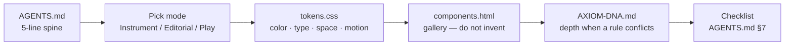

<p align="center">
  
</p>

<p align="center"><em>Design-system workshop — Axiom X civic product language.<br>
The floating HUD, palettes, type samples, spacing ladder, radius chips, and component chrome in this banner are <strong>illustration only</strong>. They are not a live product screenshot, not an operations interface, and not the token sheet. Tokens live in <a href="tokens.css"><code>tokens.css</code></a>.</em></p>

# Axiom Design Core

**The living design system for Axiom — decision systems for cities, governments, and operators.**

[axiom.nonarkara.org](https://axiom.nonarkara.org) · Bangkok · **Axiom X Co., Ltd.** · [Nonarkara/Axiom-Design-Core](https://github.com/Nonarkara/Axiom-Design-Core)

> Beauty is what remains after everything that does not work is gone.  
> Function first. Then subtract. The subtraction is the beauty.  
> One bold move, purely cut, until it looks like it was always there.

[](LICENSE)

Throw this repo at any agent — Claude Code, Cursor, Cline, Continue, Aider, Windsurf, GPT, Copilot, or anything that will read a file. The 5-line spine is [`AGENTS.md`](AGENTS.md). Install steps for each agent type are in [`USAGE.md`](USAGE.md). The full law is [`AXIOM-DNA.md`](AXIOM-DNA.md) (v2.1, Living Edition).

---

## Contents

1. [What this is](#what-this-is)
2. [Philosophy](#philosophy)
3. [Ethical use](#ethical-use)
4. [How it works](#how-it-works)
5. [How to use](#how-to-use)
6. [License](#license)

---

## What this is

This repository is the **public design core** for Axiom X Co., Ltd. It is a drop-in operating standard: tokens, modes, bans, a live component gallery, and the DNA any agent needs to ship a surface that looks Axiom-correct on the first pass.

It is **not** a dashboard, **not** a client production stack, **not** an `npm` component library, and **not** a secret intelligence platform. The site at [axiom.nonarkara.org](https://axiom.nonarkara.org) is a sibling product ([Nonarkara/Axiom](https://github.com/Nonarkara/Axiom)). This repo is the grammar that product — and the civic systems around it — are supposed to speak.

**Axiom X design / civic product language** means:

- **Instrument first.** Operators stare at these surfaces. Every mark has to serve a decision, not a moodboard.
- **Hairline geometry.** Warm paper (`#f6f5f2`), enclosed blue identity (`#26243F`), one bare red spike (`#A8322B`). Square corners (0–2 px). No gradients, drop shadows, or glassmorphism.
- **Earned content only.** Function buys the right to be seen. Decoration is a lie about who we are.
- **Agents as the delivery path.** The DNA is written so a coding agent can apply it without a design review in the room.

| If you are… | Read |
|---|---|
| An **AI agent** | [`AGENTS.md`](AGENTS.md) — the 5-line DNA |
| **Installing** in a project | [`USAGE.md`](USAGE.md) — one-shot, project, or global |
| Looking for the **full law** | [`AXIOM-DNA.md`](AXIOM-DNA.md) — 22 sections, every rule, every code example |
| A **human** wanting a drop-in sheet | This README, then [`tokens.css`](tokens.css) |

Sibling public work (linked, not nested here):

| Repo | What it is |
|---|---|
| [Nonarkara/Axiom](https://github.com/Nonarkara/Axiom) | The studio landing page and live demonstration |
| [Rams-NYCTA-Design-Core](https://github.com/Nonarkara/Rams-NYCTA-Design-Core) | Rams’s principles with Vignelli/NYCTA wayfinding — a related lineage, a separate repository |

This checkout does **not** contain that Rams × NYCTA `NOTICE.md`. Commentary on Rams and the 1970 NYCTA Graphics Standards Manual in this repo is commentary. It does not license those works.

---

## Philosophy

Governments do not have a technology problem. They have a **speed** problem. The slide deck that took three months to approve is obsolete before it ships. Axiom builds working surfaces on real data before the meeting. This design core exists so those surfaces stay honest when the next agent — or the next city — picks up the file.

**MoMA Law × Golden Section × The Divine Move = Axiom.**

- **MoMA Law** — every edge resolves to another edge. Nothing floats. The grid is invisible because everything snaps to it.
- **Golden Section** — find φ (1.618) in every split, margin, and composition. Never a lazy 50/50.
- **The Divine Move** — exactly one bold gesture per surface: the one the function already demanded, executed full-size in pure form, until it looks inevitable rather than daring. Never two. Two is noise.

Four habits underneath every Axiom surface: **balanced, compact, no non-sense, communicative.** They are the taste layer below the rules. Full text: [`AGENTS.md`](AGENTS.md) §4.

Pick the **mode** by the human's act, not by taste.

| | Instrument | Editorial | Play |
|---|---|---|---|
| **Human is** | operating | reading / thinking | learning / playing |
| **Artifacts** | dashboards, systems, infographics, live tools | documents, CVs, essays, reports, decks | board/card/flashcard games, workbooks |
| **Type** | Inter only | Spectral serif permitted | either |
| **Color** | grey + blue identity + one red spike | grey + one accent | trunk subsystem permitted |
| **Corners** | square (0–2 px) | square | Sato mercy-radius permitted |
| **Density** | maximum | 60–72 ch measure | generous, hand-scale |

When unsure: **Instrument is the default.** It is the most disciplined and the hardest to cheat.

The Color Law (Thai flag — meaning encoded):

```
Is it DATA (live / critical / down)?  → bare --red. No disc.
Is it IDENTITY (which board / who)?   → enclose it. Blue disc or rule.
Is it DIRECTIONAL (go here / more)?   → greyscale triangle.
None of these?                        → no color. Grey + size.
```

If you add color "to liven it up," you have failed every master. Delete it.

The manga banner at the top of this README is the civic-studio frame: a person building a system, not a vendor screenshot. The HUD drawn around that tablet is **illustration only**. Do not copy spacing ladders, radius chips, or component chrome from the drawing. The real scales are in [`tokens.css`](tokens.css) (spacing `2 / 6 / 11 / 13 / 16 / 22 / 44 / 88`; corners 0–2 px except the documented Sato mercy-radius in Play).

---

## Ethical use

This work is for **civic decision-making**: city operations, transit, flood watch, campus intelligence, open indices, public briefings. The point is a faster, more honest decision — with a human still in the loop.

It is **not** an official product of a ministry, municipality, or UN body unless a committed file in *this* repository says so. None does. A fork of the design system is still a fork. Keep provenance honest.

**Use this work to:**

- Make state visible before action. Vital signs up, controls near, provenance shown.
- Label measured vs modelled. Never dress a scenario as a live gauge.
- Keep identity enclosed (blue) and the one exception bare (red). Signal by shape and label, not by color alone.
- Credit the source wherever illustration appears.

**Do not use this work as:**

- **Surveillance theatre.** A HUD aesthetic is not a classified sensor net. The banner HUD is drawn.
- **A fake live interface.** Do not present `docs/hero-banner.png` as a screenshot of a product. Concept sheets in [`assets/photos/`](assets/photos/) are documentation diagrams, not operations rooms.
- **Invented secrets.** This repository has none. No API keys, tokens, or unpublished endpoints belong in a fork's README. None are required to use these files.
- **Implied government endorsement.** Shipping a surface that *looks* like Axiom does not confer operational authority.
- **A claim of formal certification.** Alignment with OECD / UNESCO AI ethics, PDPA, or ISO practice — if stated on a live Axiom product — is operational alignment, not a certificate printed by this repo.
- **Decoration of civic harm.** Do not use the red spike to dramatize. Red is live, critical, or negative. Absence of red is the good news.
- **Unlicensed lineage as a product.** Rams, Vignelli/NYCTA, and the other names in the DNA are a stated lineage. Quoting them as commentary is not a license to ship their marks.

**Illustration in product surfaces** is banned except one: [Xiaohei](https://github.com/helloianneo/ian-xiaohei-illustrations) (Ian Neo) — the Sato mercy-radius applied to imagery. Use it for empty states, errors, onboarding, and Play. Not as the hero of an Instrument dashboard. One character per surface. Keep the character's own palette. Link the source. Full doctrine: [`AXIOM-DNA.md`](AXIOM-DNA.md) §17.2. The README manga banner is a separate civic-studio convention for this public page; it is not a license to illustrate Instrument dashboards.

Honesty over polish: show provenance, dates, delay, uncertainty. Never touch the data. A sign read twice has failed.

---

## How it works

No framework. No bundler. No build step. Read the spine, import the tokens, do not invent variants.


```mermaid
flowchart LR
    A["AGENTS.md<br/>5-line spine"] --> M["Pick mode<br/>Instrument / Editorial / Play"]
    M --> T["tokens.css<br/>color · type · space · motion"]
    T --> C["components.html<br/>gallery — do not invent"]
    C --> D["AXIOM-DNA.md<br/>depth when a rule conflicts"]
    D --> K["Checklist<br/>AGENTS.md §7"]
```

| File | What it actually is |
|---|---|
| [`AGENTS.md`](AGENTS.md) | The DNA any agent loads first. Equation, modes, Color Law, spines, bans, checklist. |
| [`CLAUDE.md`](CLAUDE.md) | Claude Code entry. Same law, agent-specific pointer order. |
| [`AXIOM-DNA.md`](AXIOM-DNA.md) | Full operating standard. 22 sections. Motion craft is §13 (v2.1). |
| [`USAGE.md`](USAGE.md) | Install path per agent: one-shot, project-wide, global. |
| [`tokens.css`](tokens.css) | Drop-in CSS variables. Inter + Spectral. Hairline grid utilities. |
| [`components.html`](components.html) | Live rendered gallery. Open in a browser. Reference; do not invent. |
| [`quick-start.html`](quick-start.html) | Minimal Instrument-mode page. Clone and edit. |
| [`docs/hero-banner.png`](docs/hero-banner.png) | README illustration. HUD is drawn, not captured. |
| [`assets/photos/`](assets/photos/) | Eight concept sheets (`axiom-concept-01` … `08`). Diagrams of the system, not product screenshots. |
| [`LICENSE`](LICENSE) | MIT. Copyright © 2026 Non Arkaraprasertkul / Axiom X Co., Ltd. |

**What is live vs illustrated**

| Surface | Honest status |
|---|---|
| Manga banner (`docs/hero-banner.png`) | Illustration. HUD / palettes / components are drawn. |
| Concept sheets (`assets/photos/axiom-concept-*.png`) | Documentation diagrams of modes, color, grid, interaction. |
| [`components.html`](components.html) | Real HTML/CSS gallery using `tokens.css`. Open locally. Not deployed as a product from this repo. |
| [`tokens.css`](tokens.css) | The actual token sheet. This is the source of truth for color, type, space, and motion. |
| axiom.nonarkara.org | Sibling site. Separate repository. Not built by a script in *this* tree. |

The hairline cell grid — the signature Instrument move:

```html
<div style="display:grid; grid-template-columns:repeat(4,1fr);
            gap:1px; background:var(--line); border:1px solid var(--line);">
  <div style="background:var(--panel); padding:13px 16px;">…cell…</div>
</div>
```

Hard bans (non-negotiable): gradients, drop shadows, glows, blurs, glassmorphism; rounded corners beyond 0–2 px except documented Sato mercy-radius; a second free accent; pure `#000` or `#fff`; emoji and stock imagery; font weights 700+ on data; centering dense content; entrance choreography / parallax in Instrument; bounce / elastic easing always; decoration of any kind. Motion craft: [`AXIOM-DNA.md`](AXIOM-DNA.md) §13. Full ban list: §20.

---

## How to use

You do not need Docker, a database, an API key, or a cloud account. There is no `package.json` in this tree, so `npm run dev` has nothing to bind to.

### One-shot — any agent, any project

```bash
git clone https://github.com/Nonarkara/Axiom-Design-Core.git design-core
```

Then tell the agent:

> Read `design-core/AGENTS.md` and apply the Axiom design system. Use `design-core/tokens.css` for color and typography. Reference `design-core/components.html` — do not invent variants.

### Drop the tokens into HTML

```html
<link rel="stylesheet" href="tokens.css">
```

Core tokens (the rest, including motion curves, live in the file):

```css
:root {
  --paper: #f6f5f2;   /* page ground — warm, never pure #fff */
  --panel: #ffffff;   /* cells, instrument faces */
  --ink: #191712;     /* primary text */
  --ink-2: #6f6c63;   /* secondary text */
  --ink-3: #a9a59a;   /* labels, meta */
  --line: #e7e5dd;    /* hairlines, gaps */
  --line-2: #d2cfc5;  /* stronger borders */
  --blue: #26243F;    /* the law — identity, enclosed */
  --red: #A8322B;     /* the Move — live, critical, bare */
  --font-sans: 'Inter', 'Helvetica Neue', Helvetica, Arial, sans-serif;
  --font-serif: 'Spectral', Georgia, 'Times New Roman', serif;
}
```

Open [`components.html`](components.html) and [`quick-start.html`](quick-start.html) in a browser from this folder. That is the gallery and the template. Nothing in this repository starts a server.

### Persistent install

Copy [`AGENTS.md`](AGENTS.md) to the project root so the agent loads it every session. Per-agent paths (Claude Code, Cursor, Cline, Continue, Aider, Windsurf, Copilot): [`USAGE.md`](USAGE.md).

### Verify the install

Ask the agent:

> Without referencing any project, what is the Axiom Color Law?

A correct install returns the DATA / IDENTITY / DIRECTIONAL / none tree (bare red, enclosed blue, greyscale triangle, else grey + size). If it says color should "liven it up," `AGENTS.md` is not being loaded.

### Fork without destroying the language

MIT lets you use, copy, modify, and ship. Civic-studio forks still have to be honest:

1. Keep [`LICENSE`](LICENSE) and the copyright line (**Non Arkaraprasertkul / Axiom X Co., Ltd.**, 2026).
2. Do not restyle Instrument surfaces into Tailwind / shadcn / rounded-card templates.
3. Do not invent a second accent, a radius scale from the manga HUD, or tokens that are not in `tokens.css`.
4. Do not add application secrets to this design core. There are none to copy.
5. When a rule in a short file conflicts with [`AXIOM-DNA.md`](AXIOM-DNA.md), the DNA wins — then subtract again.
6. Run the [`AGENTS.md`](AGENTS.md) §7 checklist before declaring a surface done. One Divine Move per surface. Trace it to a function or delete it.

Agent path in short: read `AGENTS.md` → pick the mode → import `tokens.css` → reference `components.html` → checklist → ship.

---

## License

This project is licensed under the **MIT License**. Copyright © 2026 **Non Arkaraprasertkul / Axiom X Co., Ltd.** See [`LICENSE`](LICENSE).

The MIT grant covers original work in this repository. It does not license Dieter Rams's ten principles, the 1970 NYCTA Graphics Standards Manual, Xiaohei illustrations (Ian Neo — separate repo, separate terms), or third-party type (Inter, Spectral — their own licenses). Quote the lineage; do not ship the marks as if they were yours.

*axiom.nonarkara.org · Non Arkaraprasertkul · Axiom X Co., Ltd. · MIT License.*
